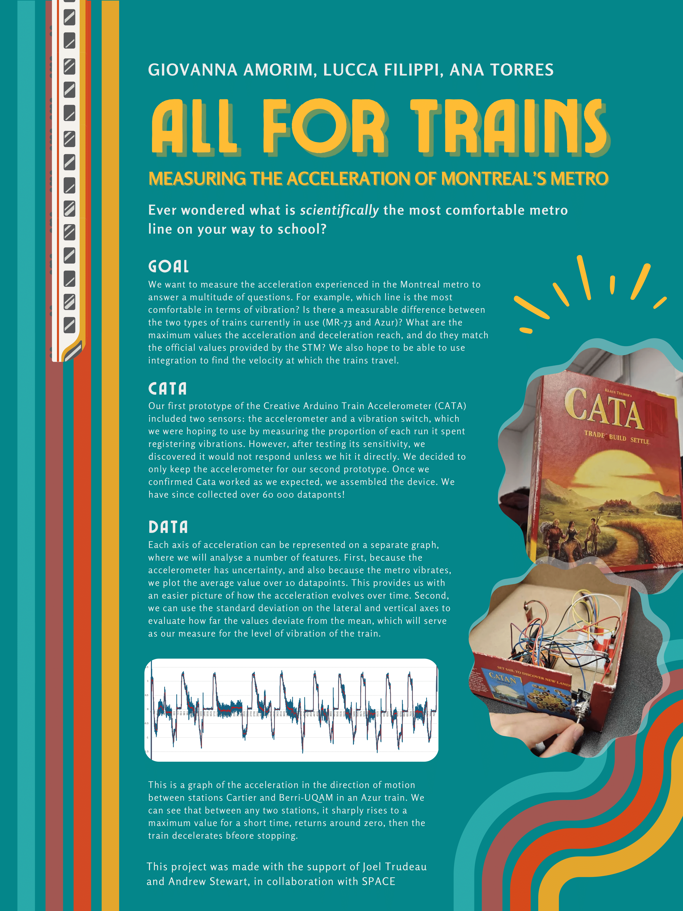

# AFT Projects

We are a happy group of three friends, motivated to *acquire knowledge* and *create fun stuff*! 😊

Check out our project **CATA**, where we collected and analyzed the acceleration in Montreal's metro and stay tuned for our next project!

## Cata

Our goal was to collect data on the acceleration experienced in the Montréal metro. We used an Arduino electronic circuit to power an accelerometer within a box we place on the metro for this purpose. We look at vibration levels, maximal acceleration, and maximal deceleration as comparisons between different lines and train types. The questions answered by this project are ones that we naturally asked ourselves when taking the metro every day getting to school, and we finally found a creative way to answer them. The poster attached presents our findings in further detail.

